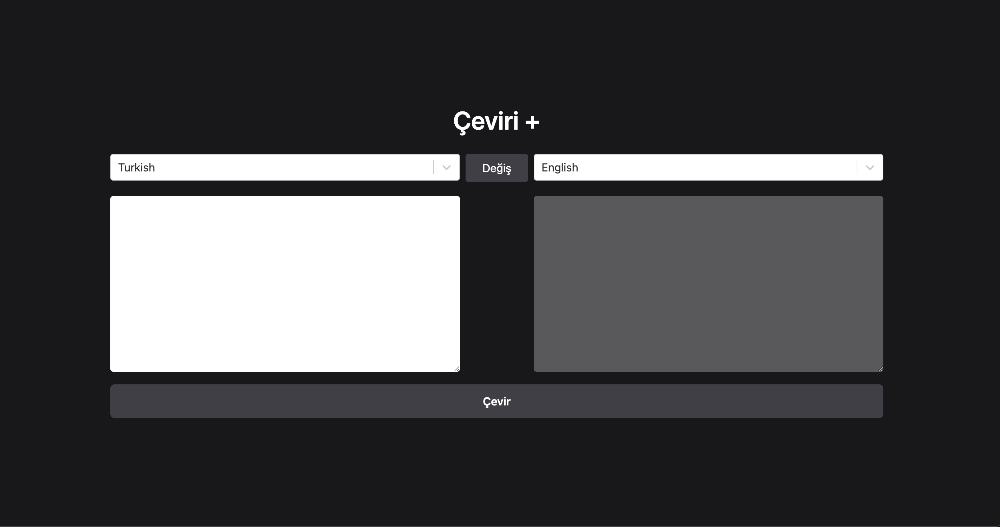

### Toolkit Translate


Toolkit Translate is a translation application designed to demonstrate effective state management and asynchronous operations using Redux Toolkit and toolkit-thunk.


<h2> Video gif</h2>


<h2>ScreenShoot</h2>




## Table of Contents


- Description
- Features
- Technologies
- Installation
- Usage
- Contributing
- Contact


## Description

Toolkit Translate is focused on managing state efficiently while handling asynchronous tasks in a translation application. The primary goal of this project is to leverage Redux Toolkit for state management and toolkit-thunk for asynchronous operations.

## Features

- Translation Capabilities: Translate text between different languages.
- Language Selection: Choose languages from two different tabs for translation.
- React Select: Enhanced language selection with a searchable dropdown.
- State Management: Efficient management of application state using Redux Toolkit.
- Asynchronous Operations: Handle API calls and other asynchronous tasks with toolkit-thunk.
- API Integration: Send requests to the translation API via RapidAPI.
-User Interface: Simple and user-friendly interface for entering and displaying translations.


## Technologies 
The main technologies and libraries used in this project are:


- React
- Vite
- React Redux
- React Redux
- toolkit-thunk for handling async operations
- React-select
- Axios for making HTTP requests
- Tailwind CSS for styling
- React Select for enhanced dropdowns
- RapidAPI for translation API integration


 ##  Installation 

- Clone the project to your local machine:
git clone https://github.com/ozerbaykal/toolkit-translate.git

- Navigate to the project directory:
```
cd toolkit-translate
```
- Install the necessary packages:
```
npm install
```
### or
 ```
 yarn install
```

## Usage

- Start the development server:
```
npm run dev
```
### or
```
yarn dev
```

<h2>Contributing</h2>

Contributions are welcome! Please open an issue first to discuss what you would like to change.

- 1.Fork the project 
- 2.Create your feature branch (git checkout -b feature/NewFeature)
- 3.Commit your changes (git commit -m 'Add new feature')
- 4.Push to the branch (git push origin feature/NewFeature)
- 5.Open a Pull Request


<h2>Contact</h2>


Özer BAYKAL  mail : baykalozer87@gmail.com

Project Link: https://github.com/ozerbaykal/toolkit-job-app